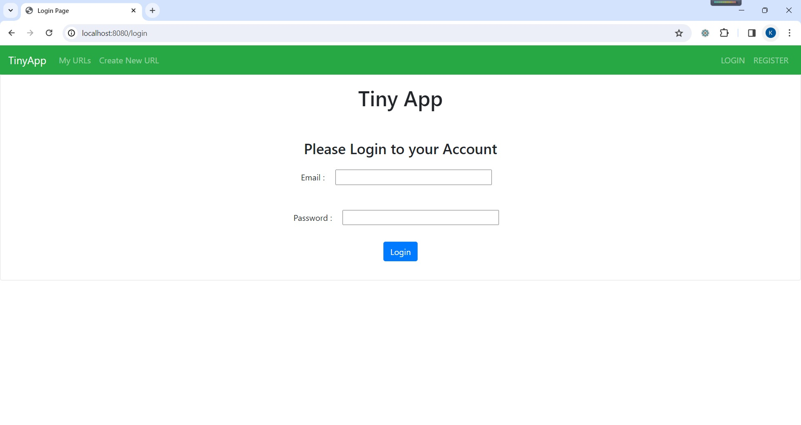
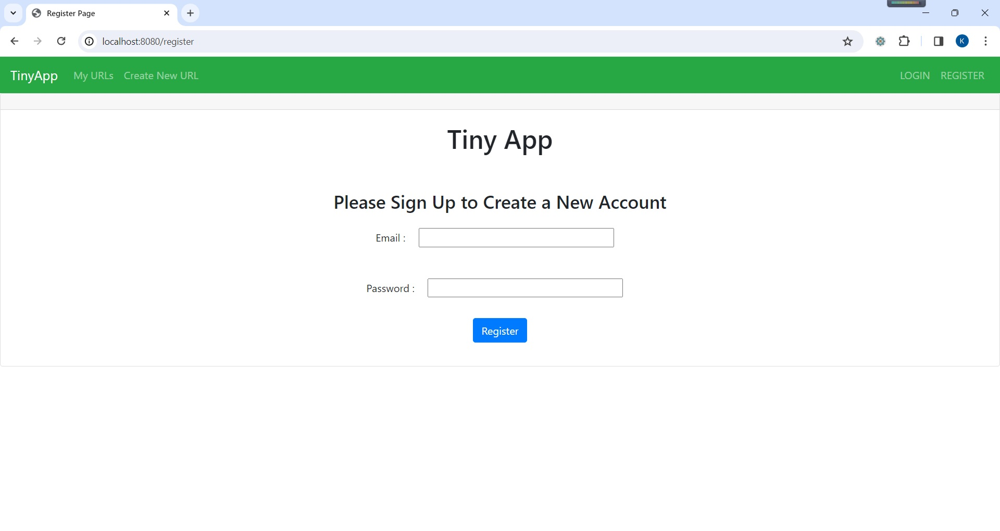
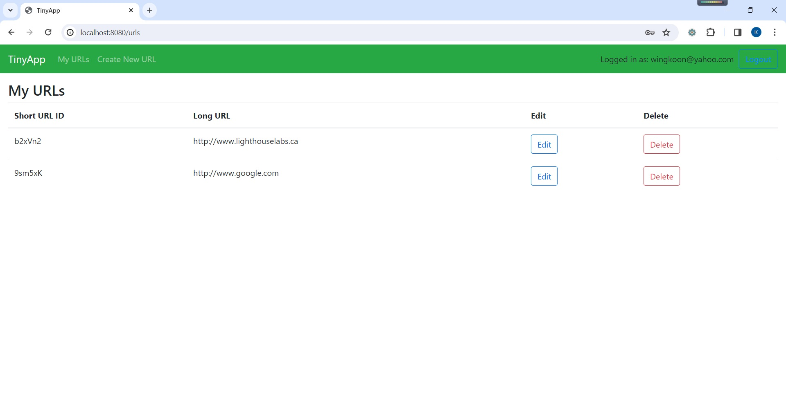
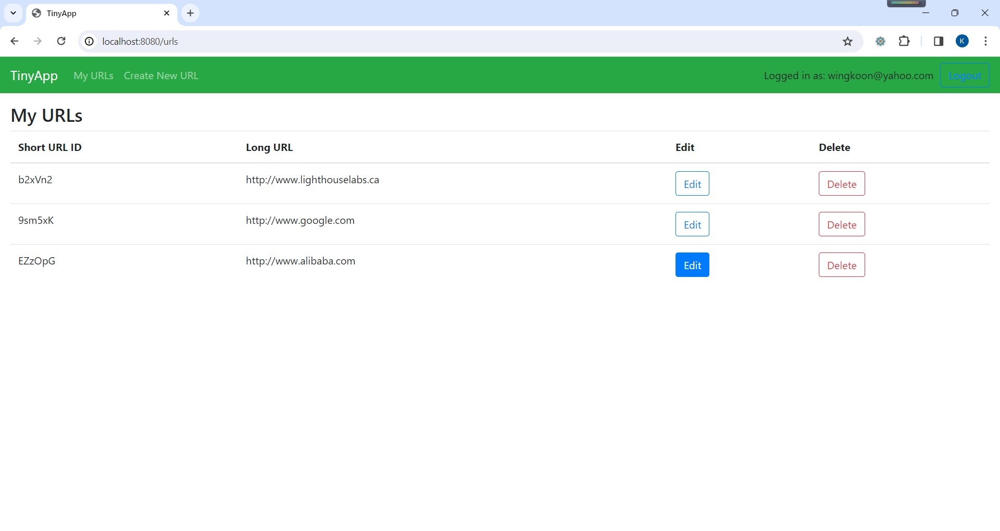
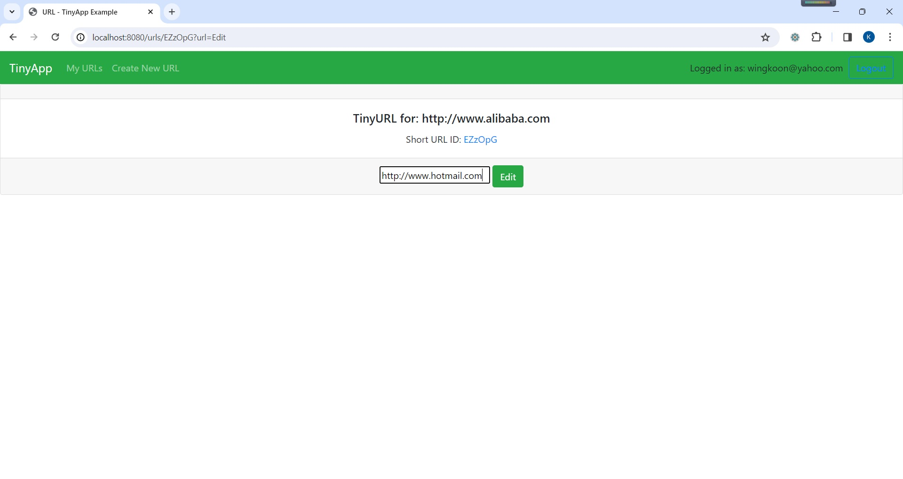
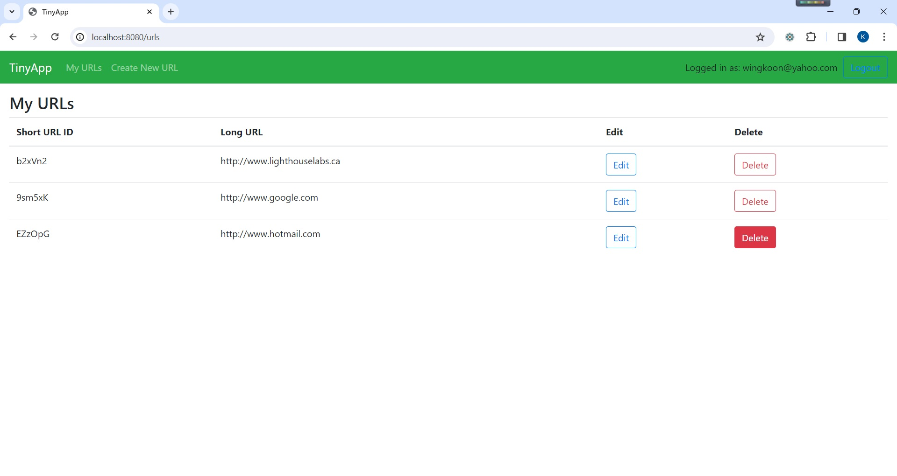

# TinyApp Project
by Kevin, Wing Koon Leung

TinyApp is a full stack web application built with Node and Express that allows users to shorten long URLs (à la bit.ly).

## Final Product

## Technologies Used
- HTML5
- EJS
- JavaScript 
- bcrypt (for encryption)
- Node.js and Express (for backend server functionality)

## Dependencies

- Node.js
- Express
- EJS
- bcryptjs
- cookie-session

## Getting Started

1. Download the software.

git clone git@github.com:wingkoon/tinyapp.git

2. Prepare for the dependency.

- Go to the directory /tinyapp
- Install all dependencies (using the `npm install` command).
i.e.,       
    npm install
    npm install bcryptjs
    npm install cookie-session

3. Run your node server.

- Run the development web server using the `npm run start` command.

4. Browse to `http://localhost:8080/`

- Enjoy all its features

